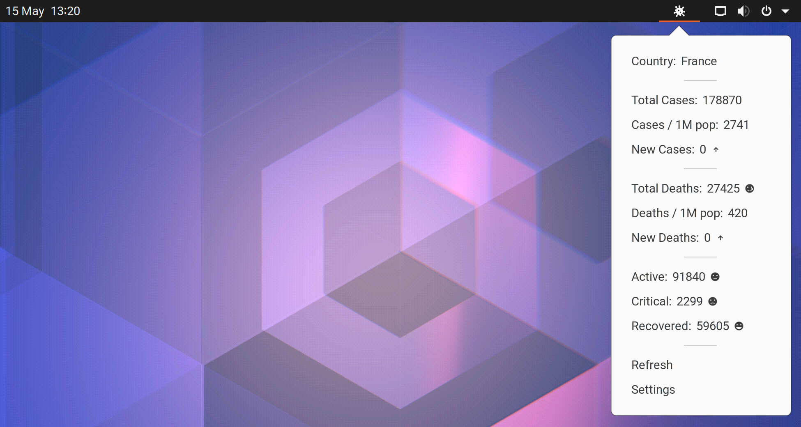

# corona-tracker

A GNOME Shell extension *(GNOME Panel applet)* to notify you every day with information about the COVID-19 virus spread.

**Please stay at home, save lives.**

## Screenshot

## Usage

At `GNOME Panel icon > Settings` you can choose the country for which the data is displayed. 

## Installation

- You can simply install this extension from [it's extensions.gnome.org page](https://extensions.gnome.org/extension/2767/corona-tracker)[^1],
  
  [^1]: You could update it from here in the future.
  
- **or** you can pull it from it's GitHub source code repository directly into it's required GNOME Shell directory [^2]

  1.  `git clone https://github.com/lachhebo/corona-tracker.git ~/.local/share/gnome-shell/extensions/corona-tracker@lachhebo.github.io`
  2.  Restart your shell: **[ALT]** + **[F2]** + *'**r**'* + **[Enter]** *(or logout and login again)*
  3.  Enable the extension manually with '***GNOME Extensions***' application *(or with '**GNOME Tweaks**' application)*.
  
  [^2]: DO not change this directory name!

## Contributors 

- [Ismaël Lachheb](https://github.com/lachhebo)
- [Jonathan Snyder](https://github.com/jpsnyder)
- [Tamas-Toth-ebola](https://github.com/Tamas-Toth-ebola)

## Credits

- A huge thanks to the people who made this API freely available: https://github.com/NovelCOVID/API
- Panel icon is from [Material Design Icons](https://materialdesignicons.com) ([license](https://github.com/google/material-design-icons/blob/master/LICENSE)).

## License

[GNU - General Public License v3](https://www.gnu.org/licenses/gpl-3.0.en.html)
